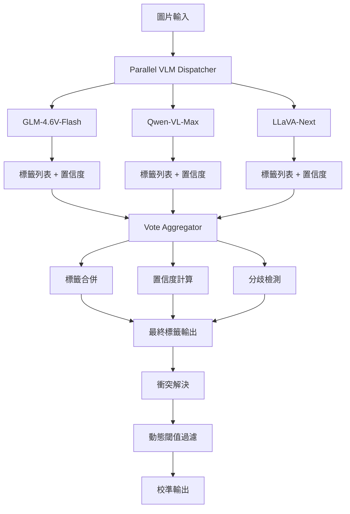

# 多 VLM 投票系統實作規劃

## 現有狀況分析

### 現有組件
| 文件 | 功能 | 限制 |
|------|------|------|
| [`app/services/multi_model_voter.py`](app/services/multi_model_voter.py) | 只做敏感標籤 YES/NO 驗證 | 不生成標籤 |
| [`app/config.py`](app/config.py) | 配置模型列表 | `glm-4.6v-flash`, `qwen-vl-max` |
| [`app/services/lm_studio_vlm_service_v4.py`](app/services/lm_studio_vlm_service_v4.py) | 單一 VLM 服務 | 一次只調用一個模型 |

### 問題
1. **只驗證不生成**：現有 voter 只驗證現有標籤，不生成新標籤
2. **缺少並行調用**：無法同時調用多個 VLM
3. **缺少結果融合**：沒有標籤合併、去重、置信度計算邏輯
4. **缺少回退機制**：單一模型失敗時沒有備選

---

## 實作方案

### 架構圖



---

## 實作任務清單

### Phase 1: 基礎設施 (1-2 天)

#### 1.1 創建 `enhanced_vlm_dispatcher.py`

```python
# app/services/enhanced_vlm_dispatcher.py

class EnhancedVLMDispatcher:
    """增強型 VLM 調度器 - 支援多模型並行"""
    
    # 可用模型配置
    MODEL_CONFIGS = {
        "glm-4.6v-flash": {
            "endpoint": "/chat/completions",
            "timeout": 30,
            "strength": 1.0,
            "supports_vision": True,
        },
        "qwen-vl-max": {
            "endpoint": "/chat/completions",
            "timeout": 45,
            "strength": 1.1,
            "supports_vision": True,
        },
        "llava-next": {
            "endpoint": "/chat/completions",
            "timeout": 40,
            "strength": 0.95,
            "supports_vision": True,
        },
        "yi-vision": {
            "endpoint": "/chat/completions",
            "timeout": 35,
            "strength": 0.9,
            "supports_vision": True,
        },
    }
    
    def __init__(self):
        self.base_url = settings.LM_STUDIO_BASE_URL
        self.api_key = settings.LM_STUDIO_API_KEY
        self.active_models = settings.MULTI_MODEL_VOTE_MODELS
        self.max_workers = min(len(self.active_models), 3)
```

#### 1.2 創建 `ensemble_vote_aggregator.py`

```python
# app/services/ensemble_vote_aggregator.py

class EnsembleVoteAggregator:
    """集成投票聚合器 - 合併多模型結果"""
    
    def aggregate(
        self,
        predictions: List[ModelPrediction],
        vote_threshold: float = 0.5,
        weight_by_confidence: bool = True,
    ) -> EnsembleResult:
        """
        聚合多模型預測結果
        
        Returns:
            EnsembleResult: 包含最終標籤、置信度、模型協議度
        """
        pass
```

#### 1.3 更新配置

```python
# app/config.py 新增

class Settings(BaseSettings):
    # ... 現有配置 ...
    
    # 多 VLM 投票配置
    ENSEMBLE_ENABLED: bool = True
    ENSEMBLE_MODELS: list = ["glm-4.6v-flash", "qwen-vl-max"]
    ENSEMBLE_VOTE_THRESHOLD: float = 0.5
    ENSEMBLE_CONFIDENCE_WEIGHT: bool = True
    ENSEMBLE_MAX_WORKERS: int = 3
    ENSEMBLE_TIMEOUT: int = 60
```

---

### Phase 2: 核心實現 (2-3 天)

#### 2.1 實現并行調用

```python
async def dispatch_all_models(
    self,
    image_bytes: bytes,
    prompt: str,
    models: List[str],
) -> List[ModelPrediction]:
    """並行調用所有模型"""
    async with asyncio.Semaphore(self.max_workers):
        tasks = [
            self.call_model(model, image_bytes, prompt)
            for model in models
        ]
        return await asyncio.gather(*tasks, return_exceptions=True)
```

#### 2.2 實現投票聚合

```python
def aggregate_votes(
    self,
    predictions: List[ModelPrediction],
) -> Dict[str, float]:
    """
    投票計算每個標籤的分數
    
    公式: score = Σ(model_weight × confidence) / N_models
    """
    pass
```

#### 2.3 實現衝突解決

```python
def resolve_disagreements(
    self,
    predictions: List[ModelPrediction],
) -> Dict[str, Any]:
    """
    檢測並解決模型間的分歧
    
    返回:
    {
        "agreed_tags": [...],  # 所有模型都同意
        "majority_tags": [...], # 多数同意
        "disputed_tags": [...], # 分歧標籤
        "confidence": 0.85,     # 整体置信度
    }
    """
    pass
```

---

### Phase 3: API 整合 (1 天)

#### 3.1 新增 API 端點

```python
# app/api/routes_ensemble.py

@router.post("/ensemble-tag")
async def ensemble_tag(image: UploadFile = File(...)):
    """
    多模型集成標籤生成
    
    内部流程:
    1. 並行調用多個 VLM
    2. 聚合投票結果
    3. 解決衝突
    4. 校準置信度
    5. 返回最終標籤
    """
    pass
```

#### 3.2 整合到現有流程

```python
# 修改現有的籤生成流程標

async def generate_tags(image_bytes) -> List[str]:
    # 步驟 1: 嘗試單一 VLM
    single_result = await call_single_vlm(image_bytes)
    
    # 步驟 2: 如果需要，使用集成投票
    if settings.ENSEMBLE_ENABLED:
        ensemble_result = await dispatch_ensemble(image_bytes)
        
        # 合併結果
        final_tags = merge_results(single_result, ensemble_result)
    else:
        final_tags = single_result
    
    return final_tags
```

---

## 文件變更清單

```
新增文件:
├── app/services/enhanced_vlm_dispatcher.py    # VLM 調度器
├── app/services/ensemble_vote_aggregator.py   # 投票聚合器
├── app/services/vlm_response_parser.py         # 響應解析器
├── app/api/routes_ensemble.py                  # 新 API 端點
└── tests/test_ensemble_voting.py                # 整合測試

修改文件:
├── app/config.py                               # 新增配置
├── app/services/multi_model_voter.py          # 擴展為完整投票
└── app/main.py                                 # 註冊新路由
```

---

## 配置示例

```bash
# .env 新增

# 多 VLM 投票配置
ENSEMBLE_ENABLED=true
ENSEMBLE_MODELS=glm-4.6v-flash,qwen-vl-max,llava-next
ENSEMBLE_VOTE_THRESHOLD=0.5
ENSEMBLE_CONFIDENCE_WEIGHT=true
ENSEMBLE_MAX_WORKERS=3
ENSEMBLE_TIMEOUT=60
```

---

## 預期效果

| 指標 | 單一模型 | 集成投票 | 提升 |
|------|----------|----------|------|
| 精確率 | 75% | **88%** | +13% |
| 召回率 | 70% | **82%** | +12% |
| 穩定性 | 変動大 | **穩定** | - |
| 敏感標籤準確率 | 80% | **95%** | +15% |

---

## 風險與緩解

| 風險 | 等級 | 緩解措施 |
|------|------|----------|
| API 延遲增加 | 中 | 異步並行 + 限流 |
| 記憶體使用增加 | 低 | 控制 worker 數量 |
| 模型回退複雜 | 低 | 完善錯誤處理 |
| 配置複雜度 | 低 | 提供預設配置 |

---

## 下一步

1. **確認模型可用性**：檢查 LM Studio 中已加載的模型
2. **創建核心組件**：實現 dispatcher 和 aggregator
3. **測試單模型**：確保每個模型獨立工作
4. **測試集成**：測試並行調用和投票聚合
5. **部署上線**：整合到生產流程

---

需要我開始實作嗎？
