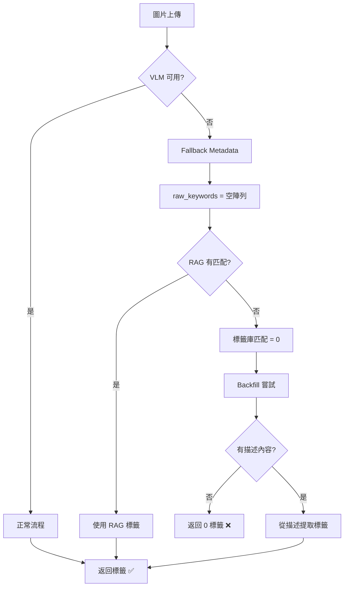

# Fallback 機制優化計畫

## 問題摘要

當 VLM 服務不可用時，系統返回 0 個標籤，導致用戶無法獲得任何標籤建議。

### 問題鏈分析



---

## 解決方案架構

### 核心策略：多層降級機制


---

## 詳細設計

### 1. 改進 Fallback Metadata

**當前問題：** `_get_fallback_metadata()` 返回空的 `raw_keywords`

**解決方案：** 提供智能預設關鍵詞

```python
def _get_fallback_metadata(self, error_message: str) -> Dict[str, Any]:
    # 嘗試從錯誤訊息中提取有用信息
    fallback_keywords = self._extract_keywords_from_error(error_message)
    
    return {
        "description": f"Analysis fallback: {error_message}",
        "character_types": [],
        "clothing": [],
        "body_features": [],
        "actions": [],
        "themes": [],
        "settings": [],
        "raw_keywords": fallback_keywords,  # 不再是空的
        "fallback_mode": True,  # 標記為 fallback 模式
    }
```

### 2. 降低 RAG 閾值策略

**當前問題：** `RAG_SIMILARITY_THRESHOLD = 0.50` 在 fallback 模式下過高

**解決方案：** 動態閾值調整

```python
# 在 tag_recommender_service.py 中
if vlm_analysis.get("fallback_mode"):
    # Fallback 模式下降低閾值
    rag_threshold = max(0.25, settings.RAG_SIMILARITY_THRESHOLD - 0.25)
    logger.info(f"Fallback mode: using reduced RAG threshold {rag_threshold}")
else:
    rag_threshold = settings.RAG_SIMILARITY_THRESHOLD
```

### 3. 新增緊急標籤推薦服務

**新增服務：** `EmergencyTagService`

```python
class EmergencyTagService:
    """緊急標籤服務 - 當所有其他方法失敗時提供基本標籤"""
    
    # 基於統計的常見標籤（按優先級排序）
    COMMON_TAGS = [
        # 角色類型（最常見）
        ("少女", 0.7, "character"),
        ("女性", 0.8, "character"),
        
        # 體型特徵
        ("巨乳", 0.5, "body"),
        ("貧乳", 0.5, "body"),
        
        # 服裝
        ("校服", 0.5, "clothing"),
        ("泳裝", 0.4, "clothing"),
        
        # 主題
        ("戀愛", 0.5, "theme"),
    ]
    
    async def get_emergency_tags(
        self, 
        image_bytes: bytes,
        top_k: int = 5
    ) -> List[TagRecommendation]:
        """返回基於統計的常見標籤"""
        recommendations = []
        
        for tag, confidence, category in self.COMMON_TAGS[:top_k]:
            recommendations.append(
                TagRecommendation(
                    tag=tag,
                    confidence=confidence,
                    source="emergency_fallback",
                    reason="基於統計的常見標籤（VLM 不可用）"
                )
            )
        
        return recommendations
```

### 4. 修改主流程整合

**修改 `tag_recommender_service.py` 的 `recommend_tags` 方法：**

```python
async def recommend_tags(self, ...):
    # ... 現有邏輯 ...
    
    # 最終檢查：如果仍然沒有標籤，啟動緊急模式
    if len(unique_recommendations) == 0:
        logger.warning("All tagging methods failed. Activating emergency fallback.")
        
        emergency_service = get_emergency_tag_service()
        emergency_tags = await emergency_service.get_emergency_tags(
            image_bytes, top_k=top_k
        )
        
        unique_recommendations.extend(emergency_tags)
        logger.info(f"Emergency fallback provided {len(emergency_tags)} tags")
    
    return unique_recommendations[:top_k]
```

---

## 實施計畫

### Phase 1: Fallback Metadata 改進
- [ ] 修改 `_get_fallback_metadata()` 提供預設關鍵詞
- [ ] 添加 `fallback_mode` 標記
- [ ] 測試 fallback 路徑

### Phase 2: 動態閾值調整
- [ ] 在 `tag_recommender_service.py` 添加閾值調整邏輯
- [ ] 根據 fallback 模式動態調整 RAG 閾值
- [ ] 添加配置項控制降級行為

### Phase 3: 緊急標籤服務
- [ ] 創建 `EmergencyTagService` 類別
- [ ] 整合到主流程
- [ ] 添加統計數據支持

### Phase 4: 監控與日誌
- [ ] 添加 fallback 模式計數器
- [ ] 記錄降級事件
- [ ] 提供管理介面查看統計

---

## 配置項新增

```python
# app/config.py 新增

# Fallback 設定
FALLBACK_ENABLED: bool = True
FALLBACK_RAG_THRESHOLD_REDUCTION: float = 0.25
FALLBACK_MIN_RAG_THRESHOLD: float = 0.20

# 緊急模式設定
EMERGENCY_FALLBACK_ENABLED: bool = True
EMERGENCY_DEFAULT_TAGS: list = [
    "少女", "女性", "巨乳", "校服", "戀愛"
]
```

---

## 預期效果

### 修改前
```
VLM unavailable → 0 keywords → 0 RAG matches → 0 tags ❌
```

### 修改後
```
VLM unavailable 
  → fallback keywords 
  → reduced RAG threshold 
  → emergency tags if still 0 
  → 至少返回 3-5 個標籤 ✅
```

---

## 風險評估

| 風險 | 影響 | 緩解措施 |
|------|------|----------|
| 緊急標籤不準確 | 中 | 標記為低置信度，用戶可刪除 |
| 閾值過低導致噪音 | 低 | 動態調整，僅在 fallback 時降低 |
| 效能影響 | 低 | 緊急服務使用預計算數據 |

---

## 測試計畫

1. **單元測試**
   - 測試 `_get_fallback_metadata()` 返回值
   - 測試動態閾值計算
   - 測試緊急標籤服務

2. **整合測試**
   - 模擬 VLM 不可用場景
   - 驗證完整降級流程
   - 確認至少返回標籤

3. **端到端測試**
   - 關閉 LM Studio 測試
   - 驗證用戶體驗
