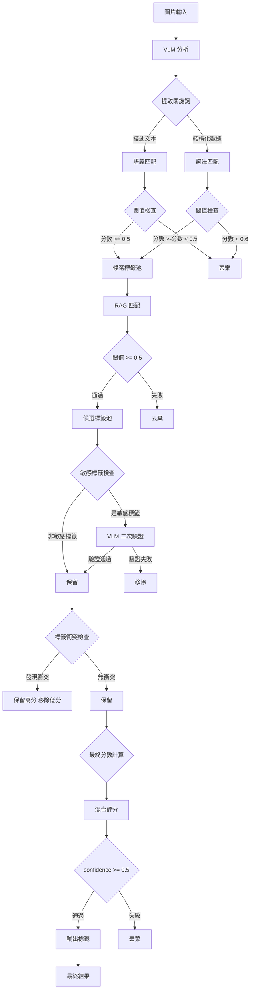
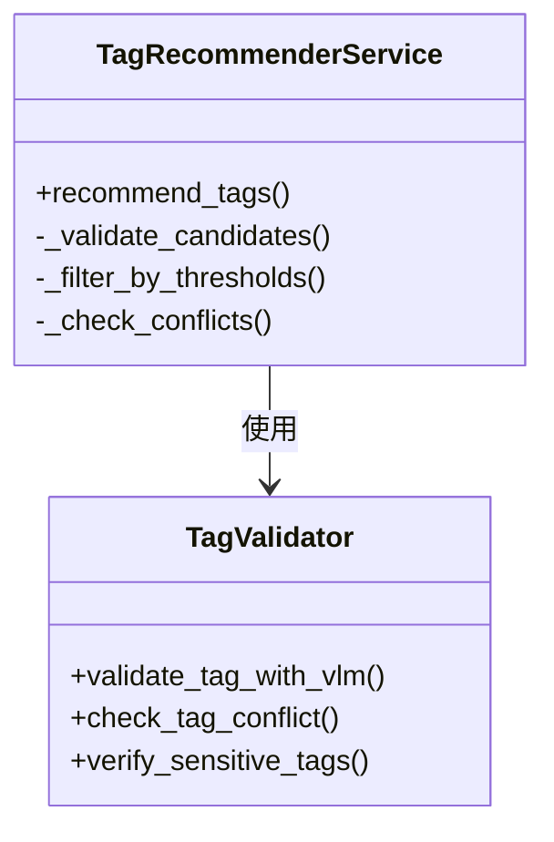

# 優化後的標籤推薦流程

## 流程圖

## 閾值對照表

| 階段 | 參數 | 舊值 | 新值 | 說明 |
|------|------|------|------|------|
| 詞法匹配 | min_confidence | 0.4 | **0.6** | 提升精確度 |
| 語義匹配 | threshold | 0.3 | **0.5** | 減少噪音 |
| RAG 匹配 | threshold | 0.25 | **0.5** | 過濾低質量匹配 |
| 最終輸出 | confidence_threshold | 0.5 | **0.5** | 保持不變 |

## 新增組件

