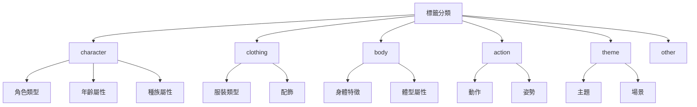
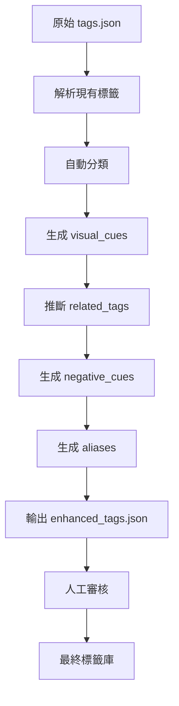
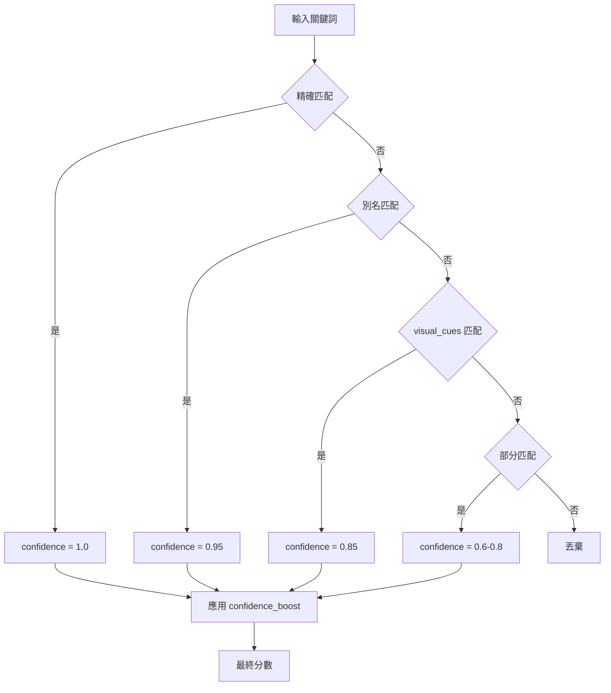
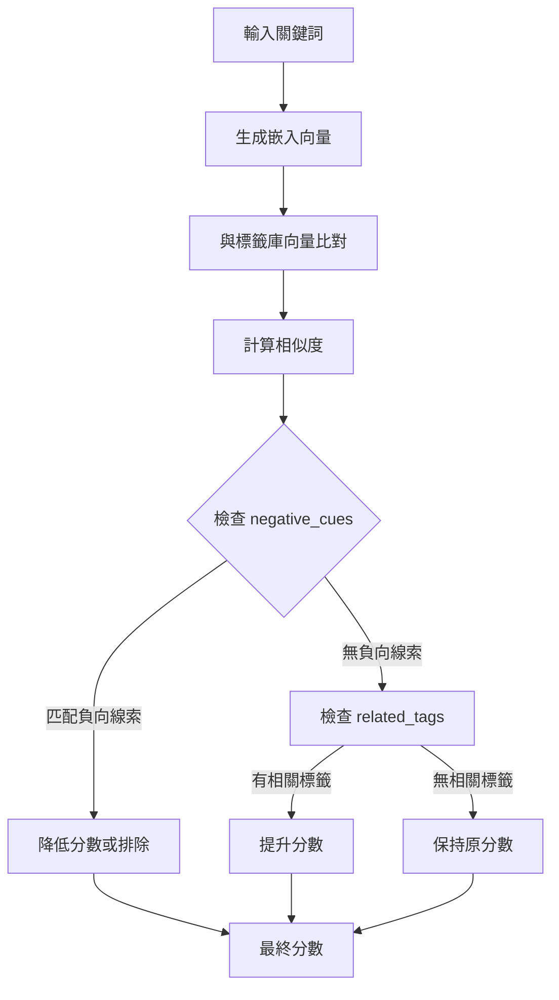
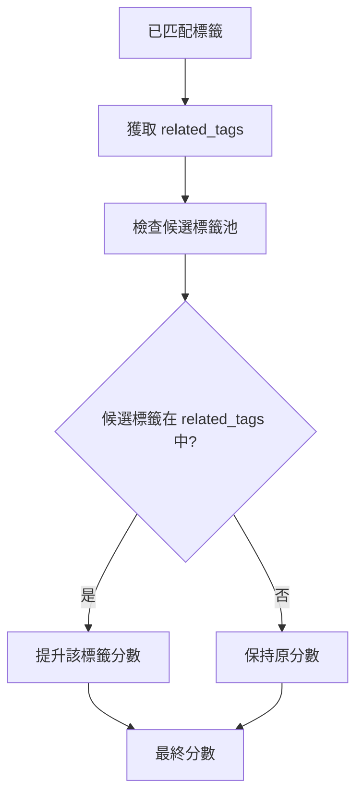
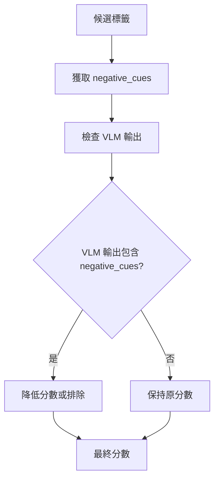

# 標籤描述增強方案

## 1. 方案概述

### 1.1 目標
不改變 VLM 調用方式，通過增強標籤庫的描述結構，提升標籤匹配的精確度。

### 1.2 核心策略
- 擴展標籤資料結構，新增視覺線索、相關標籤、負向線索等欄位
- 利用增強資訊優化詞法匹配和語義匹配邏輯
- 保持向後相容性，確保現有系統正常運作

---

## 2. 增強標籤庫資料結構

### 2.1 新標籤結構定義

```json
{
  "tag": "貓娘",
  "category": "character",
  "description": "貓娘，具有貓耳和貓尾的女性角色",
  "visual_cues": ["貓耳", "貓尾", "貓瞳", "鬍鬚"],
  "related_tags": ["動物娘", "獸耳", "貓耳"],
  "negative_cues": ["純人類", "無動物特徵"],
  "aliases": ["catgirl", "nekomimi", "貓耳娘"],
  "confidence_boost": 1.1
}
```

### 2.2 欄位說明

| 欄位 | 類型 | 必填 | 說明 |
|------|------|------|------|
| `tag` | string | 是 | 標籤名稱（主鍵） |
| `category` | string | 是 | 標籤分類：character/clothing/body/action/theme/other |
| `description` | string | 是 | 標籤詳細描述 |
| `visual_cues` | array | 否 | 視覺特徵關鍵詞列表 |
| `related_tags` | array | 否 | 相關標籤列表（用於關聯匹配） |
| `negative_cues` | array | 否 | 負向線索（排除條件） |
| `aliases` | array | 否 | 別名列表（用於詞法匹配） |
| `confidence_boost` | float | 否 | 信心度加成係數（默認 1.0） |

### 2.3 分類體系



---

## 3. 標籤庫遷移策略

### 3.1 遷移流程



### 3.2 遷移腳本設計

```python
# 遷移腳本主要功能
class TagMigrator:
    def migrate_tags(self, input_path: str, output_path: str):
        """遷移標籤庫到增強格式"""
        
    def auto_categorize(self, tag_name: str, description: str) -> str:
        """自動分類標籤"""
        
    def extract_visual_cues(self, description: str) -> List[str]:
        """從描述中提取視覺線索"""
        
    def infer_related_tags(self, tag_name: str, category: str) -> List[str]:
        """推斷相關標籤"""
        
    def generate_negative_cues(self, tag_name: str, description: str) -> List[str]:
        """生成負向線索"""
        
    def generate_aliases(self, tag_name: str) -> List[str]:
        """生成別名列表"""
```

### 3.3 向後相容性

- 保留原始 `tag_name` 和 `description` 欄位
- 新增欄位為可選，默認值為空陣列或默認值
- [`TagLibraryService`](app/services/tag_library_service.py:15) 同時支援舊格式和新格式

---

## 4. 增強匹配邏輯

### 4.1 增強詞法匹配



### 4.2 增強語義匹配



### 4.3 關聯標籤增強



### 4.4 負向線索過濾



---

## 5. 服務層修改

### 5.1 TagLibraryService 修改

```python
class TagLibraryService:
    def __init__(self, tag_library_path: Optional[str] = None):
        # 新增欄位
        self.tag_visual_cues: Dict[str, List[str]] = {}
        self.tag_related_tags: Dict[str, List[str]] = {}
        self.tag_negative_cues: Dict[str, List[str]] = {}
        self.tag_aliases: Dict[str, List[str]] = {}
        self.tag_confidence_boost: Dict[str, float] = {}
        
    def _load_tags(self):
        """支援新格式標籤庫"""
        # 原有邏輯
        # 新增：解析新欄位
        
    def match_tags_by_keywords_enhanced(
        self, keywords: List[str], min_confidence: float = 0.6
    ) -> List[Tuple[str, float]]:
        """增強詞法匹配"""
        # 1. 精確匹配
        # 2. 別名匹配
        # 3. visual_cues 匹配
        # 4. 部分匹配
        # 5. 應用 confidence_boost
        
    def get_tag_visual_cues(self, tag_name: str) -> List[str]:
        """獲取視覺線索"""
        
    def get_tag_related_tags(self, tag_name: str) -> List[str]:
        """獲取相關標籤"""
        
    def get_tag_negative_cues(self, tag_name: str) -> List[str]:
        """獲取負向線索"""
        
    def get_tag_aliases(self, tag_name: str) -> List[str]:
        """獲取別名"""
```

### 5.2 TagRecommenderService 修改

```python
class TagRecommenderService:
    async def recommend_tags(self, ...):
        # 原有邏輯
        
        # 新增：使用增強詞法匹配
        library_matches = self.tag_library.match_tags_by_keywords_enhanced(
            mapped_keywords, min_confidence=lexical_threshold
        )
        
        # 新增：應用關聯標籤增強
        recommendations = self._apply_related_tags_boost(
            recommendations, candidate_scores
        )
        
        # 新增：應用負向線索過濾
        recommendations = self._apply_negative_cues_filter(
            recommendations, vlm_analysis
        )
        
    def _apply_related_tags_boost(
        self, recommendations: List[TagRecommendation],
        candidate_scores: Dict[str, Dict[str, float]]
    ) -> List[TagRecommendation]:
        """應用關聯標籤增強"""
        
    def _apply_negative_cues_filter(
        self, recommendations: List[TagRecommendation],
        vlm_analysis: Dict[str, Any]
    ) -> List[TagRecommendation]:
        """應用負向線索過濾"""
```

---

## 6. 測試驗證方案

### 6.1 單元測試

```python
# tests/test_enhanced_tag_library.py
class TestEnhancedTagLibrary:
    def test_load_enhanced_tags(self):
        """測試載入增強格式標籤庫"""
        
    def test_match_with_aliases(self):
        """測試別名匹配"""
        
    def test_match_with_visual_cues(self):
        """測試視覺線索匹配"""
        
    def test_negative_cues_filter(self):
        """測試負向線索過濾"""
        
    def test_related_tags_boost(self):
        """測試關聯標籤增強"""
        
    def test_confidence_boost(self):
        """測試信心度加成"""
```

### 6.2 整合測試

```python
# tests/test_enhanced_tag_recommender.py
class TestEnhancedTagRecommender:
    async def test_recommend_with_enhanced_library(self):
        """測試使用增強標籤庫的推薦"""
        
    async def test_precision_improvement(self):
        """測試精確度提升"""
        
    async def test_recall_maintenance(self):
        """測試召回率維持"""
```

### 6.3 基準測試

| 指標 | 優化前 | 優化後目標 | 測試方法 |
|------|--------|-----------|---------|
| 精確度 (Precision) | 基準值 | +10% | 使用測試集驗證 |
| 召回率 (Recall) | 基準值 | 不降低 | 使用測試集驗證 |
| F1 分數 | 基準值 | +5% | 計算 F1 分數 |
| 匹配速度 | 基準值 | 不降低 | 性能測試 |

---

## 7. 實施步驟

### 7.1 階段一：準備階段

1. **創建遷移腳本**
   - 實現 [`TagMigrator`](#32-遷移腳本設計) 類
   - 測試遷移邏輯

2. **生成增強標籤庫**
   - 運行遷移腳本
   - 人工審核和修正

3. **創建測試數據**
   - 準備測試圖片集
   - 準備預期標籤集

### 7.2 階段二：開發階段

1. **修改 [`TagLibraryService`](app/services/tag_library_service.py:15)**
   - 新增欄位解析
   - 實現增強匹配方法

2. **修改 [`TagRecommenderService`](app/services/tag_recommender_service.py:31)**
   - 整合增強匹配
   - 實現關聯增強和負向過濾

3. **更新配置**
   - 新增相關配置參數

### 7.3 階段三：測試階段

1. **單元測試**
   - 測試各個增強功能

2. **整合測試**
   - 測試完整流程

3. **基準測試**
   - 對比優化前後性能

### 7.4 階段四：部署階段

1. **備份現有標籤庫**
2. **部署新標籤庫**
3. **部署新代碼**
4. **監控運行狀態**

---

## 8. 風險評估與緩解

| 風險 | 影響 | 概率 | 緩解措施 |
|------|------|------|---------|
| 遷移腳本生成錯誤 | 高 | 中 | 人工審核 + 分批遷移 |
| 匹配邏輯引入 bug | 高 | 中 | 完整測試 + 灰度發布 |
| 性能下降 | 中 | 低 | 性能測試 + 優化 |
| 向後相容性問題 | 中 | 低 | 保留舊格式支援 |

---

## 9. 預期效果

### 9.1 精確度提升

- **別名匹配**：解決同義詞匹配問題
- **視覺線索**：提升視覺特徵匹配精確度
- **負向線索**：減少誤匹配

### 9.2 擴展性提升

- **結構化資料**：便於後續擴展
- **分類體系**：便於管理和維護
- **關聯關係**：便於實現智能推薦

### 9.3 可維護性提升

- **標準化格式**：統一標籤定義
- **文檔化**：清晰的欄位說明
- **工具化**：自動化遷移和驗證

---

## 10. 後續優化方向

1. **自動化標籤庫維護**
   - 定期更新 visual_cues
   - 自動推斷 related_tags

2. **機器學習增強**
   - 使用 ML 模型自動生成 visual_cues
   - 學習標籤之間的關聯關係

3. **用戶反饋整合**
   - 收集用戶反饋
   - 持續優化標籤庫

---

## 附錄

### A. 標籤庫範例

```json
[
  {
    "tag": "貓娘",
    "category": "character",
    "description": "貓娘，具有貓耳和貓尾的女性角色",
    "visual_cues": ["貓耳", "貓尾", "貓瞳", "鬍鬚"],
    "related_tags": ["動物娘", "獸耳", "貓耳"],
    "negative_cues": ["純人類", "無動物特徵"],
    "aliases": ["catgirl", "nekomimi", "貓耳娘"],
    "confidence_boost": 1.1
  },
  {
    "tag": "蘿莉",
    "category": "character",
    "description": "有性暗示或裸體的未成年少女外觀角色。應擁有未充分發育的身體。",
    "visual_cues": ["嬌小身材", "平胸", "可愛臉龐", "大眼睛"],
    "related_tags": ["年輕女孩", "小女孩", "未成年"],
    "negative_cues": ["成熟女性", "巨乳", "豐滿身材"],
    "aliases": ["loli", "little girl"],
    "confidence_boost": 1.0
  },
  {
    "tag": "校服",
    "category": "clothing",
    "description": "學校制服，通常包括上衣、裙子、領帶等",
    "visual_cues": ["制服", "領帶", "格子裙", "學校徽章"],
    "related_tags": ["學生", "學校", "制服"],
    "negative_cues": ["便服", "正式服裝"],
    "aliases": ["school uniform", "制服", "學生服"],
    "confidence_boost": 1.0
  }
]
```

### B. 配置參數

```python
# app/config.py 新增配置
class Settings:
    # 增強匹配配置
    ENABLE_ENHANCED_MATCHING: bool = True
    ENABLE_ALIASES_MATCHING: bool = True
    ENABLE_VISUAL_CUES_MATCHING: bool = True
    ENABLE_RELATED_TAGS_BOOST: bool = True
    ENABLE_NEGATIVE_CUES_FILTER: bool = True
    
    # 匹配閾值
    ALIASES_MATCH_CONFIDENCE: float = 0.95
    VISUAL_CUES_MATCH_CONFIDENCE: float = 0.85
    RELATED_TAGS_BOOST_FACTOR: float = 0.1
    NEGATIVE_CUES_PENALTY: float = 0.3
```
