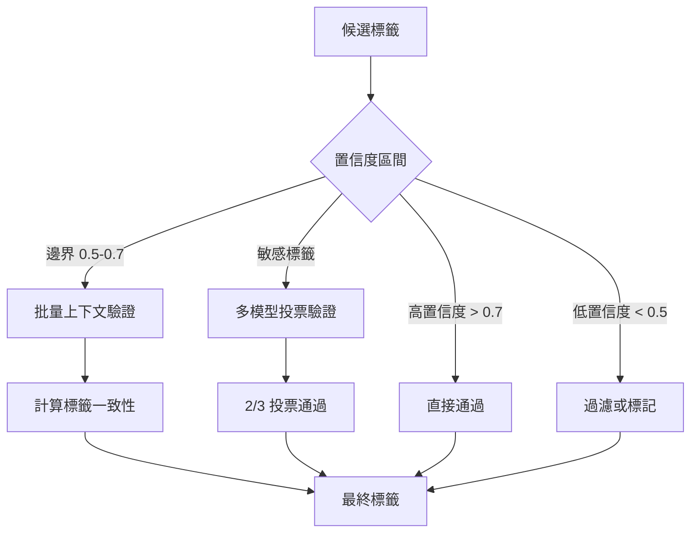

# 精準度優化方案 - 項目 4-6

## 項目 4：調整置信度參數

### 目標
微調配置參數，提升標籤匹配精度

### 修改文件
- [`app/config.py`](app/config.py)

### 參數調整
```python
# 當前值 -> 建議值
ALIASES_MATCH_CONFIDENCE: float = 0.95  # 維持不變或微調至 0.93
VISUAL_CUES_MATCH_CONFIDENCE: float = 0.85  # 維持不變或微調至 0.87
RELATED_TAGS_BOOST_FACTOR: float = 0.1  # 可調整至 0.08-0.12
NEGATIVE_CUES_PENALTY: float = 0.3  # 可調整至 0.25-0.35
```

### 執行步驟
1. 修改 `app/config.py` 參數
2. 運行測試驗證效果
3. 根據結果微調

---

## 項目 5：批量圖片上下文一致性檢查

### 目標
利用批量圖片的上下文關係，驗證標籤在系列圖片中的一致性

### 新增文件
- `app/services/batch_context_validator.py`

### 核心功能
```python
class BatchContextValidator:
    """批量圖片上下文驗證器"""
    
    async def validate_batch_tags(
        self,
        images: List[bytes],
        candidate_tags: Dict[str, float]
    ) -> Dict[str, float]:
        """驗證標籤在批量圖片中的出現一致性"""
        pass
    
    def calculate_tag_consistency(
        self,
        tag: str,
        tag_scores: List[float]
    ) -> float:
        """計算標籤在批量圖片中的出現一致性分數"""
        pass
```

### 執行步驟
1. 建立 `BatchContextValidator` 類
2. 實現批量圖片分析邏輯
3. 整合至 `tag_recommender_service_enhanced.py`
4. 添加配置開關

---

## 項目 6：多模型交叉投票驗證

### 目標
使用多個 VLM 模型進行交叉驗證，提高敏感標籤準確率

### 新增文件
- `app/services/multi_model_voter.py`

### 核心功能
```python
class MultiModelVoter:
    """多模型投票驗證器"""
    
    MODELS = [
        "glm-4.6v-flash",  # 主要模型
        "qwen-vl-max",      # 第二模型（需確認可用性）
    ]
    
    async def vote_verify(
        self,
        image_bytes: bytes,
        tag: str
    ) -> Tuple[bool, float]:
        """多模型投票驗證標籤"""
        pass
    
    async def batch_vote_verify(
        self,
        image_bytes: bytes,
        tags: List[str]
    ) -> Dict[str, Tuple[bool, float]]:
        """批量投票驗證"""
        pass
```

### 執行步驟
1. 建立 `MultiModelVoter` 類
2. 實現多模型 API 調用
3. 實現投票邏輯
4. 整合至 `tag_validator.py`
5. 添加配置開關

---

## 架構圖



---

## 配置開關設計

```python
# app/config.py 新增
ENABLE_BATCH_CONTEXT_VALIDATION: bool = False
ENABLE_MULTI_MODEL_VOTING: bool = False
MULTI_MODEL_VOTE_THRESHOLD: float = 0.67  # 2/3 = 67%
BATCH_CONTEXT_MIN_IMAGES: int = 3  # 最少圖片數
```

---

## 預期效果

| 項目 | 精確率提升 | 延遲增加 |
|------|-----------|----------|
| 項目 4：參數調整 | +2-5% | 無 |
| 項目 5：批量驗證 | +5-10% | +50-100ms/圖 |
| 項目 6：多模型投票 | +10-15% | +200-500ms/圖 |

---

## 測試計劃

1. 基準測試：記錄當前精確率
2. 項目 4 測試：逐步調整參數
3. 項目 5 測試：使用 3-5 張系列圖片
4. 項目 6 測試：對敏感標籤進行投票
5. 整合測試：端到端驗證
